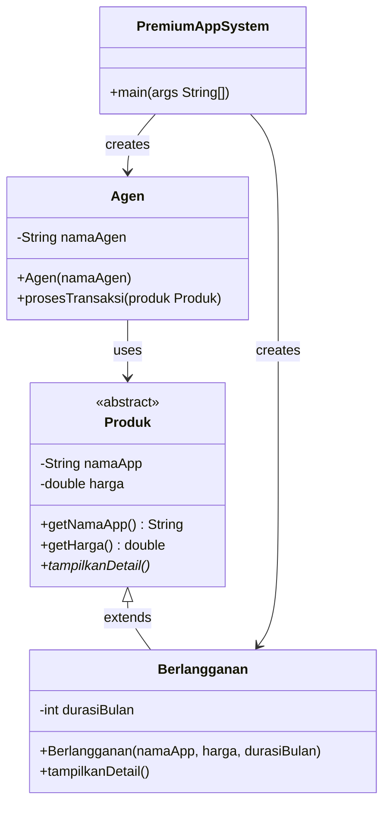
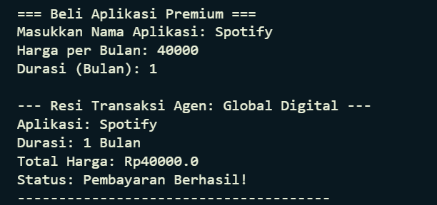

# Premium App System
> Simulasi sistem pembelian aplikasi premium berbasis konsep **Object-Oriented Programming (OOP)** menggunakan Java.

---

## Deskripsi Kasus

Program ini mensimulasikan proses pembelian aplikasi premium secara berlangganan (*subscription*) melalui seorang agen digital. Pengguna memasukkan nama aplikasi, harga per bulan, dan durasi berlangganan. Sistem kemudian menghitung total biaya dan mencetak resi transaksi melalui agen.

**Alur program:**
1. Pengguna diminta memasukkan data aplikasi dan durasi berlangganan
2. Sistem membuat objek `Berlangganan` yang merupakan turunan dari `Produk`
3. Objek `Agen` memproses transaksi dan mencetak resi pembayaran

---

## Class Diagram



**Keterangan relasi:**
- `Berlangganan` mewarisi (`extends`) `Produk` — relasi *Inheritance*
- `Agen` menggunakan parameter bertipe `Produk` — relasi *Dependency* (mendukung Polymorphism)
- `PremiumAppSystem` (main) membuat objek `Agen` dan `Berlangganan`

---

## Kode Program

```java
import java.util.Scanner;

abstract class Produk {
    private String namaApp;
    private double harga;

    public Produk(String namaApp, double harga) {
        this.namaApp = namaApp;
        this.harga = harga;
    }

    public String getNamaApp() { return namaApp; }
    public double getHarga() { return harga; }

    public abstract void tampilkanDetail();
}

class Berlangganan extends Produk {
    private int durasiBulan;

    public Berlangganan(String namaApp, double harga, int durasiBulan) {
        super(namaApp, harga);
        this.durasiBulan = durasiBulan;
    }

    @Override
    public void tampilkanDetail() {
        System.out.println("Aplikasi: " + getNamaApp());
        System.out.println("Durasi: " + durasiBulan + " Bulan");
        System.out.println("Total Harga: Rp" + (getHarga() * durasiBulan));
    }
}

class Agen {
    private String namaAgen;

    public Agen(String namaAgen) {
        this.namaAgen = namaAgen;
    }

    public void prosesTransaksi(Produk produk) {
        System.out.println("\n--- Resi Transaksi Agen: " + namaAgen + " ---");
        produk.tampilkanDetail();
        System.out.println("Status: Pembayaran Berhasil!");
        System.out.println("--------------------------------------");
    }
}

public class PremiumAppSystem {
    public static void main(String[] args) {
        Scanner input = new Scanner(System.in);
        Agen agenBaru = new Agen("Global Digital");

        System.out.println("=== Beli Aplikasi Premium ===");
        System.out.print("Masukkan Nama Aplikasi: ");
        String nama = input.nextLine();
        System.out.print("Harga per Bulan: ");
        double harga = input.nextDouble();
        System.out.print("Durasi (Bulan): ");
        int durasi = input.nextInt();

        // Objek Polimorfisme: Tipe Produk, Instansiasi Berlangganan
        Produk pembelian = new Berlangganan(nama, harga, durasi);

        agenBaru.prosesTransaksi(pembelian);
    }
}
```

---

## Screenshot Output



---

## Penjelasan Prinsip OOP yang Diterapkan

### 1. Encapsulation (Enkapsulasi)

Atribut pada setiap class dideklarasikan sebagai `private` sehingga tidak dapat diakses langsung dari luar class. Akses hanya dilakukan melalui method `getter` yang bersifat `public`.

```java
// Atribut disembunyikan (private)
private String namaApp;
private double harga;

// Akses hanya lewat getter (public)
public String getNamaApp() { return namaApp; }
public double getHarga()   { return harga; }
```

| Class | Atribut Private | Getter Publik |
|---|---|---|
| `Produk` | `namaApp`, `harga` | `getNamaApp()`, `getHarga()` |
| `Berlangganan` | `durasiBulan` | (digunakan langsung di dalam class) |
| `Agen` | `namaAgen` | (digunakan langsung di dalam class) |

---

### 2. Inheritance (Pewarisan)

Class `Berlangganan` mewarisi semua atribut dan method dari class `Produk` menggunakan keyword `extends`. Constructor `Berlangganan` memanggil `super()` untuk menginisialisasi atribut milik parent class.

```java
class Berlangganan extends Produk {
    // Mewarisi namaApp & harga dari Produk
    // Menambahkan atribut baru: durasiBulan

    public Berlangganan(String namaApp, double harga, int durasiBulan) {
        super(namaApp, harga); // memanggil constructor Produk
        this.durasiBulan = durasiBulan;
    }
}
```

---

### 3. Polymorphism (Polimorfisme)

Terdapat dua bentuk polimorfisme dalam program ini:

**a. Method Overriding** — `Berlangganan` meng-override method abstrak `tampilkanDetail()` dari `Produk` dengan implementasinya sendiri.

```java
@Override
public void tampilkanDetail() {
    System.out.println("Aplikasi: " + getNamaApp());
    System.out.println("Durasi: " + durasiBulan + " Bulan");
    System.out.println("Total Harga: Rp" + (getHarga() * durasiBulan));
}
```

**b. Upcasting** — Objek `Berlangganan` disimpan dalam variabel bertipe `Produk`, sehingga `Agen` tidak perlu tahu tipe konkretnya.

```java
// Tipe referensi = Produk (parent), objek nyata = Berlangganan (child)
Produk pembelian = new Berlangganan(nama, harga, durasi);

// Agen hanya perlu tahu tipe Produk, bukan Berlangganan
agenBaru.prosesTransaksi(pembelian);
```

---

### 4. 🧩 Abstraction (Abstraksi)

Class `Produk` dideklarasikan sebagai `abstract`, yang berarti tidak dapat diinstansiasi langsung. Method `tampilkanDetail()` dideklarasikan `abstract` — mewajibkan setiap subclass untuk mengimplementasikannya sesuai kebutuhan masing-masing.

```java
abstract class Produk {
    // ...
    public abstract void tampilkanDetail(); // wajib diimplementasikan subclass
}
```

Dengan abstraksi ini, class `Agen` cukup memanggil `produk.tampilkanDetail()` tanpa perlu tahu detail implementasinya — apakah itu `Berlangganan`, `PembelianSekali`, atau tipe lain yang mungkin ditambahkan di masa depan.

---

## Keunikan Program

Program ini memiliki beberapa karakteristik yang membedakannya dari implementasi OOP pada umumnya:

### Pola Desain Agen sebagai Perantara
Alih-alih langsung mencetak output dari `main()`, program ini memperkenalkan class `Agen` sebagai *mediator* antara sistem dan pengguna. Ini mencerminkan pola desain dunia nyata di mana transaksi selalu diproses melalui perantara (agen/kasir), bukan langsung oleh pembeli.

```java
// Bukan: pembelian.tampilkanDetail() — langsung dari main
// Melainkan: lewat perantara Agen
agenBaru.prosesTransaksi(pembelian);
```

### Perhitungan Harga Dinamis di Dalam Class
Total harga tidak dihitung di `main()`, melainkan langsung di dalam method `tampilkanDetail()` milik `Berlangganan`. Ini menjaga logika bisnis tetap terkapsulasi di dalam class yang bertanggung jawab.

```java
System.out.println("Total Harga: Rp" + (getHarga() * durasiBulan));
//                                       ↑ logika bisnis ada di sini
```

### Desain Terbuka untuk Ekstensi (Open/Closed Principle)
Dengan adanya abstract class `Produk`, program siap dikembangkan tanpa mengubah `Agen` atau `main()`. Contoh: cukup tambahkan class baru seperti `PembelianSekali` yang extends `Produk`, dan `Agen` langsung bisa memprosesnya tanpa perubahan apapun.

```java
// Contoh ekstensi di masa depan — Agen tidak perlu diubah sama sekali
class PembelianSekali extends Produk {
    @Override
    public void tampilkanDetail() { /* implementasi berbeda */ }
}
```

---
